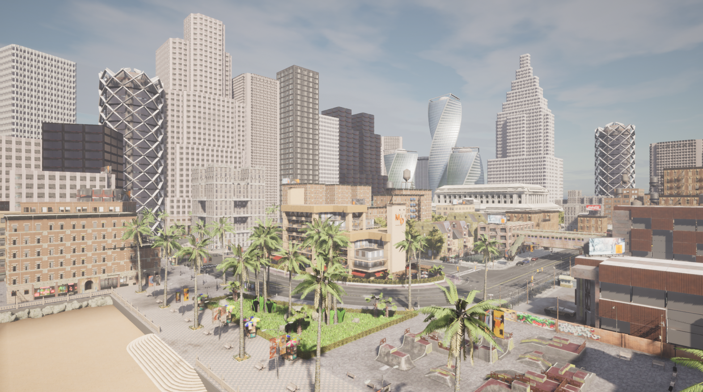

# 欢迎仪式
<b><strong>欢迎大家来到自动驾驶Player(L5Player)的自动驾驶算法与仿真空间，在这个空间我们将一起完成这些事情：<strong><b>
1. 控制算法构建基础模块并仿真调试：PID、LQR、Stanley 、MPC、滑膜控制、模糊控制、横向控制、纵向控制
2. 运动规划算法构建基础模块并仿真调试：样条曲线、贝塞尔曲线、ASTAR、RRT、动态规划、二次规划、EM Planer、Lattice Planer
3. 基于以上基础模块构建L2～L4功能模块： AEB、ACC、LKA、TJA、ALC、高速NOP、城市NOP、AVP
4. 文章、算法、理论、书籍分享；
5. 日常交流，行业咨询分享；
  

<strong>建立这个项目的目的，是希望从零开始，搭建完整的自动驾驶系统，并且与大家共同完成<strong>
 
github地址: https://github.com/L5Player/AutoDriving-Planning-Control-Algorithm-Simulation-Carla 
gitte地址：https://gitee.com/nannanbe/auto-driving-planning-control-algorithm-simulation-carla

  
  

# 首先启动Crla仿真器
1. 在Carla下运行：./CarlaUE4.sh 或 ./CarlaUE4.sh -prefernvidia
  
 
 

# PID 模块启动流程
1. source source_env.sh
2. ros2 launch carla_l5player_bridge_ego_vis carla_bridge_ego_vehilce.launch.py
3. ros2 run carla_l5player_pid_controller carla_l5player_pid_controller_node
 

# Stanley 模块启动流程
1. source source_env.sh
2. ros2 launch carla_l5player_bridge_ego_vis carla_bridge_ego_vehilce.launch.py
3. ros2 run carla_l5player_stanley_pid_controller carla_l5player_stanley_pid_controller_node
 

# LQR 模块启动流程
1. source source_env.sh
2. ros2 launch carla_l5player_bridge_ego_vis carla_bridge_ego_vehilce.launch.py
3. ros2 launch carla_l5player_lqr_pid_controller lqr_launch.py
 

# MPC 模块启动流程
1. source source_env.sh
2. ros2 launch carla_l5player_bridge_ego_vis carla_bridge_ego_vehilce.launch.py
3. ros2 launch carla_l5player_mpc_controller mpc_launch.py
 

